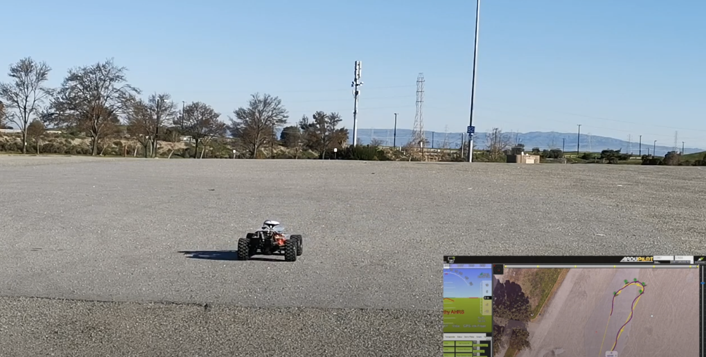

# pixhawk-xmaxx-instructions
Phase 1 setup instructions for xmaxx and pixhawk 4
The setup steps is at 
https://github.com/23garyd/xmaxx-setup/tree/main

GPS mission tests with F9P GPS

The below video is the mission with GPS RTK setup with a Mashroom antena.

